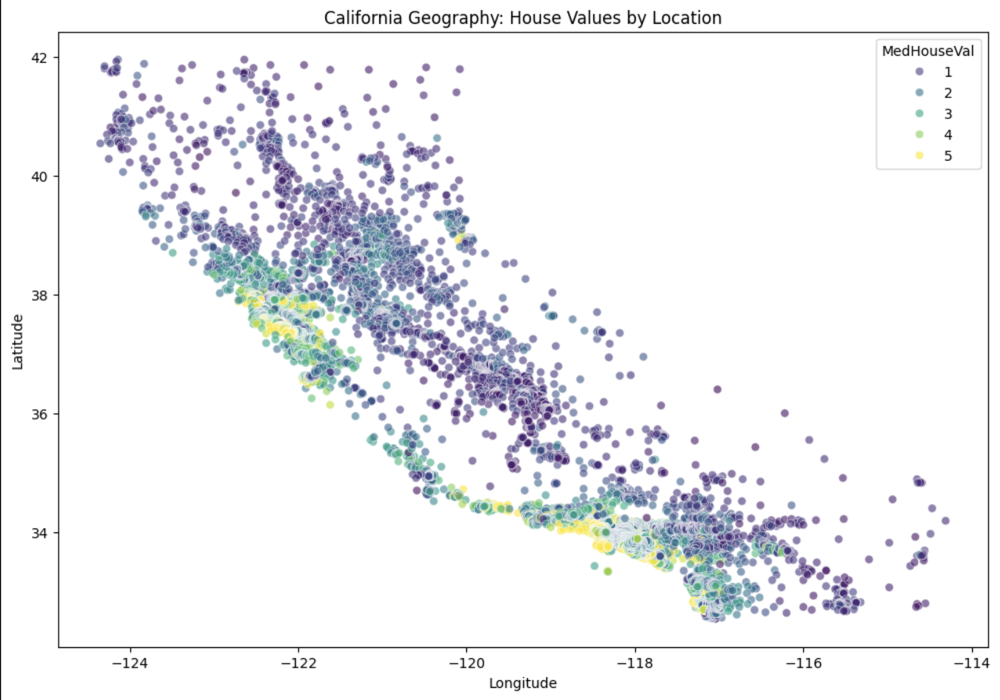

# California Housing Price Predictor – Detailed Documentation

This document provides in-depth context, visualizations, directory structure, and deployment notes for the project.

## Dataset & Model Overview
The model uses the California Housing dataset (scikit-learn / 1990 census block groups, 20,640 samples). After EDA, correlation analysis, outlier clipping (1%/99% on MedInc and AveRooms), and feature selection, five features were chosen to balance performance and simplicity:

- **MedInc** — strongest predictor (corr ~0.69)  
- **AveRooms**, **HouseAge** — moderate positive influence  
- **Latitude** & **Longitude** — kept separate to capture multiple high-value clusters (Bay Area + Los Angeles areas)

**Performance (test set):**  
MSE: 0.5068 | RMSE: 0.7119 | R²: 0.6167  

While not state-of-the-art (tree-based models reach R² > 0.80), it serves as a clean, fast baseline for deployment-focused learning.

## Importance of Location in California Housing
Location is one of the most critical drivers of house prices in California due to coastal access, job centers, schools, and topography. The scatterplot below shows median house values by geographic coordinates:



**Key observations:**
- High-value clusters (yellow) appear in the **San Francisco Bay Area** (top-left, around lat 37–38, lon -122) and **Los Angeles / Orange County** regions (bottom-right, around lat 33–34, lon -118).
- Lower values dominate inland and northern rural areas.
- This geographic pattern justifies keeping **Latitude** and **Longitude** as separate features rather than a single distance metric — a distance-to-SF feature would undervalue LA proximity.

## Final Project Directory Structure
```
CA-housing-app/ 
├── app.py 
├── ANA680_Final_Project.ipynb
├── ca_housing_pipeline.pkl 
├── requirements.txt 
├── Dockerfile 
├── .dockerignore 
├── .python-version 
├── nginx.conf 
├── docker-compose.yml 
├── .github/ 
│   └── workflows/ 
│       └── deploy-to-heroku.yml 
├── tests/ 
│   └── test_app.py 
├── templates/ 
│   └── index.html 
├── assets/ 
│   ├── ca-geography-house-values.png 
│   ├── app_blank.png 
│   └── app_filled_in.png 
├── README.md 
└── README-detailed.md
```
## Deployment Summary
- **Local**: `python app.py` → http://127.0.0.1:5000  
- **Heroku**: Auto-deployed via GitHub Actions on push to main  
- **AWS EC2**: t3.micro instance, Docker Compose with app + Nginx proxy  
  - Public URL (when running): http://54.167.189.220  
  - Security Group: ports 80 (HTTP), 22 (SSH) open  
  - Auto-start via systemd service

---
# 📋 Detailed Project Discription
#### End-to-End MLOps Pipeline: From Model Development to Cloud Deployment 
---
## Table of Contents
* [Problem Definition and Dataset](#problem-definition-and-dataset)
* [Modeling Approach](#modeling-approach)
* [Model Performance Summary](#model-performance-summary)
* [Local Flask Application Setup and Deployment](#local-flask-application-setup-and-deployment)
* [Docker Containerization and Deployment to Docker Hub](#docker-containerization-and-deployment-to-docker-hub)
* [GitHub Repository Setup and Heroku Deployment via CI/CD Pipeline](#github-repository-setup-and-heroku-deployment-via-cicd-pipeline)
* [AWS EC2 Deployment with Docker Compose and Nginx Proxy](#aws-ec2-deployment-with-docker-compose-and-nginx-proxy)


### Problem Definition and Dataset

This project aims to predict **median house values** in California census blocks using demographic and geographic features, addressing the real-world challenge of estimating property values for applications such as real estate appraisal, urban planning, investment analysis, or housing policy evaluation. Accurate predictions are difficult with traditional rule-based or statistical methods alone due to the complex, non-linear interactions among features like income levels, household size, housing age, and geographic location—patterns that are hard to capture manually but emerge clearly in data. 

Machine learning provides the best solution here because it can automatically learn these relationships from historical data, generalize to unseen examples, and improve with more data or features, offering superior predictive power and scalability compared to simpler regression formulas or expert heuristics. The dataset used is the **California Housing dataset**, originally from the 1990 California census and popularized in scikit-learn. It contains **20,640 samples** with 8 input features (e.g., median income, average rooms, latitude/longitude) and a continuous target (median house value in $100,000 units). The dataset is publicly available via scikit-learn (`fetch_california_housing(as_frame=True)`) or directly from the [StatLib repository](https://www.dcc.fc.up.pt/~ltorgo/Regression/cal_housing.html), ensuring easy reproducibility and no external dependencies for this project.


### Modeling Approach

The modeling process follows a standard supervised regression workflow implemented via a **scikit-learn Pipeline** for consistency, reproducibility, and ease of deployment. After initial exploratory data analysis (EDA) and correlation analysis, five high-relevance features were selected: **MedInc** (strongest positive correlation), **AveRooms**, **HouseAge**, **Latitude**, and **Longitude** (retaining separate geographic coordinates to capture multiple high-value clusters such as the San Francisco Bay Area and Los Angeles regions). 

Outliers in skewed features (MedInc and AveRooms) were handled via **clipping at the 1st and 99th percentiles** to reduce undue influence on the linear fit without discarding data. The data was split into training (70%), validation (15%), and test (15%) sets using a fixed random seed for reproducibility. A Pipeline was constructed to chain `StandardScaler` (to standardize features) with `LinearRegression`, ensuring identical preprocessing during training and inference. The model was trained on the training set, evaluated on validation and test sets using **MSE**, **RMSE**, and **R²** metrics (final test **R² ≈ 0.617**, **RMSE ≈ 0.712**), and serialized as a single `.pkl` file with `joblib`. 

While more advanced models could yield higher accuracy, linear regression was chosen as a simple, interpretable baseline that trains quickly and deploys easily—aligning with the project’s primary emphasis on demonstrating a complete, reproducible **CI/CD pipeline** for model training, containerization (**Docker**), API serving (**Flask**), initial deployment (**Heroku**), and production-like deployment (**AWS EC2 with Nginx proxy**), rather than maximizing predictive accuracy.


### Model Performance Summary

The linear regression model, trained on a subset of five features (`MedInc`, `AveRooms`, `HouseAge`, `Latitude`, `Longitude`) with standard scaling applied via a scikit-learn `Pipeline`, achieved the following performance metrics across the train, validation, and test sets:

* **Training** → MSE: 0.5423, RMSE: 0.7364, R²: 0.5952  
* **Validation** → MSE: 0.5567, RMSE: 0.7461, R²: 0.5727  
* **Test** → MSE: 0.5068, RMSE: 0.7119, R²: 0.6167  

These results indicate that the model explains approximately 57–62% of the variance in median house values, with an average prediction error of roughly $71,000–$75,000 (given the target is in units of $100,000). The small gap between training and test performance (R² drop of ~0.02) suggests minimal overfitting, and the residual plots show the expected pattern of heteroscedasticity typical for housing price data (wider errors at higher values), which is a known limitation of linear models on this dataset.

While these metrics are not state-of-the-art—as more advanced models like Random Forest or Gradient Boosting routinely achieve test R² values of 0.80+ and RMSE below 0.50—the performance is sufficient and appropriate for the goals of this project. This linear regression baseline provides a simple, fast-to-train model that is easy to serialize, version, and deploy consistently across environments, making it an ideal choice for emphasizing **MLOps and DevOps workflows** over cutting-edge machine learning performance.


### Local Flask Application Setup and Deployment 

To make the trained model accessible and testable on a local machine, a simple **Flask** web application was created to serve predictions via a user-friendly web interface. The process begins by organizing the project files: the saved pipeline (`ca_housing_pipeline.pkl`) is placed in the project root, a `templates` folder is created to hold the `index.html` file (which contains the input form, feature descriptions, typical value ranges, and styled prediction output), and an `app.py` file is added to define the Flask routes. 

The `app.py` script loads the pipeline using `joblib`, sets up a home route to render the form, and handles POST requests to `/predict` by collecting form inputs, converting them into a DataFrame, running them through the pipeline for prediction, and returning a formatted result (showing both the scaled value and an approximate dollar amount, e.g., **$412,300**). Dependencies are managed via a `requirements.txt` file listing Flask, joblib, pandas, numpy, and scikit-learn. 

After installing these, the application is launched by running `python app.py` in the terminal (with the virtual environment activated). This starts a local development server at `http://127.0.0.1:5000`, allowing immediate interaction: users enter values for the five features, submit the form, and see an interpreted prediction displayed below the inputs. This step validates the model's usability in a real application context, confirms consistent inference behavior (including automatic scaling), and provides a convenient way to demonstrate and debug before proceeding to containerization and cloud deployment.


### Docker Containerization and Deployment to Docker Hub

To ensure the Flask application and its trained model are portable, reproducible, and ready for cloud deployment, the project was containerized using **Docker**. A `Dockerfile` was created in the project root to define a lightweight, production-ready image based on `python:3.14-slim`, which aligns with the local development environment for consistency. 

The file copies the application code, model artifact (`ca_housing_pipeline.pkl`), and dependencies from `requirements.txt`, installs them (including **Gunicorn** as the production WSGI server), and sets the default command to `gunicorn --bind 0.0.0.0:$PORT app:app`. This binds the app to the dynamically assigned `$PORT` environment variable expected by platforms like Heroku while supporting local testing. A comprehensive `.dockerignore` file was included to exclude unnecessary items such as virtual environments, Jupyter checkpoints, and Git metadata, resulting in faster builds and a smaller image size.

The image was built locally with the command:
`docker build -t djt84/ca-housing-app:v1.0 .`

It was then tested by running:
`docker run -p 5000:5000 -e PORT=5000 djt84/ca-housing-app:v1.0` 

After verifying full functionality at `http://localhost:5000`, the image was pushed to **Docker Hub** using `docker push djt84/ca-housing-app:v1.0`. This step packages the entire application into a single, versioned artifact that can be pulled and run anywhere Docker is available. By publishing to Docker Hub, the image becomes easily accessible for subsequent deployment stages (**Heroku** staging and **AWS EC2** production), demonstrating key principles of containerization and portability central to modern CI/CD pipelines.


### GitHub Repository Setup and Heroku Deployment via CI/CD Pipeline

With the Flask application fully containerized and tested locally, the project was moved to **GitHub** for version control and automated CI/CD. A new repository was created (`ana680-project-ca-housing-app-pipeline`), and all project files—including `app.py`, the `templates/` folder, `Dockerfile`, `requirements.txt`, the saved model pipeline (`ca_housing_pipeline.pkl`), and the GitHub Actions workflow YAML (`.github/workflows/deploy-to-heroku.yml`)—were committed and pushed to the main branch.

To enable automated deployment, a **GitHub Actions** workflow was configured to trigger on pushes to `main`. The workflow automates the following steps:
1.  Checks out the code and installs the Heroku CLI.
2.  Authenticates using a securely stored API key.
3.  Logs into the **Heroku Container Registry**.
4.  Builds, tags, and pushes the Docker image.
5.  Releases the web process to the live app.

Required secrets were added in the repository settings under **Actions Secrets**: `HEROKU_API_KEY`, `HEROKU_APP_NAME`, and `DOCKERHUB_IMAGE`. 

On **Heroku**, a new app was created and set to the container stack. The first push triggered the workflow, successfully deploying the image to the live URL: [https://ca-housing-app-djt84-f1fd66680ef6.herokuapp.com/](https://ca-housing-app-djt84-f1fd66680ef6.herokuapp.com/). Visiting the URL confirmed the predictor interface loaded correctly, validating end-to-end functionality from local development through automated CI/CD to cloud hosting. This pipeline achieves **Continuous Deployment**: any qualifying change committed to `main` automatically updates the live Heroku instance, minimizing manual intervention while ensuring reproducibility—a core objective of this project's MLOps focus.


### AWS EC2 Deployment with Docker Compose and Nginx Proxy

With the application successfully deployed on Heroku, the final phase involved replicating the setup on an **AWS EC2** instance to demonstrate cloud infrastructure deployment using a **reverse proxy**. An `t3.micro` instance was launched using the **Amazon Linux 2023 AMI**, with security groups configured to allow SSH (port 22) and HTTP (port 80) traffic.

Docker was installed and configured for the `ec2-user`, and the project image (`djt84/ca-housing-app:v1.0`) was pulled directly from **Docker Hub**. To implement the **Nginx proxy**, Docker Compose was installed to orchestrate two services:
1.  **App Container**: Runs the Flask/Gunicorn application, exposed internally on port 5000.
2.  **Nginx Container**: Acts as the entry point, mapping host port 80 to the container and forwarding traffic to the app.

A `docker-compose.yml` file and a custom `nginx.conf` were used to manage this stack. The configuration utilized `proxy_pass http://app:5000;` to route traffic seamlessly. The stack was launched with:
`docker compose up -d`

Accessing the instance’s public IP ([http://54.167.189.220](http://54.167.189.220)) serves the application through Nginx without requiring a port specification in the URL. For persistence, a `systemd` service was configured to ensure the Compose stack auto-starts on boot. 

This final deployment highlights **container portability** across different cloud providers and the benefits of **multi-service orchestration**, completing the project’s progression from local development to a production-ready public cloud instance.


## Acknowledgments
Built as part of an academic MLOps/DevOps course (ANA680 - ML Deployment, National University) focusing on reproducible pipelines, containerization, and multi-cloud deployment.


